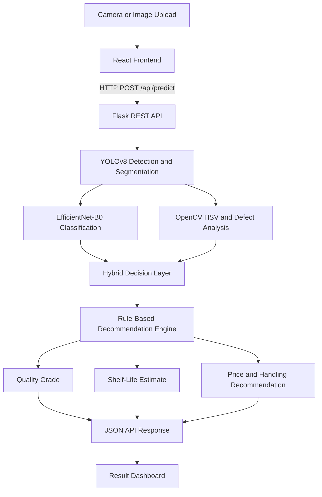

# 🥭 AI-Based Intelligent Mango Quality & Ripeness Assessment System

[](https://pytorch.org/)
[](https://react.dev/)
[](https://flask.palletsprojects.com/)
[](https://opencv.org/)

An end-to-end, multimodal **Artificial Intelligence System** designed to assess mango ripeness and quality using deep learning and computer vision. The system combines mango detection, four-class image classification, HSV colour analysis, hybrid decision-making, and rule-based recommendations to support quality assessment and post-harvest handling decisions.

---

## 🌟 Key Features

- 🧠 **Deep Learning Classification:** EfficientNet-B0 transfer learning for four-class mango quality classification.
- 🏷️ **Supervised Image Classification:** Images are organized into `Grade_A_Ripe`, `Grade_B_Unripe`, `Grade_C_Overripe`, and `Non_Mango`.
- 🎯 **Object Detection and Segmentation:** YOLOv8 models help locate mangoes and identify the relevant image region.
- 🔬 **Computer Vision Analysis:** OpenCV HSV colour analysis extracts colour and dark-spot indicators.
- 🔀 **Hybrid Decision Support:** CNN predictions are combined with colour and defect evidence for additional analysis.
- 🛡️ **Rule-Based Recommendation Engine:** Classification results are mapped to suggested price adjustments, shelf-life estimates, and handling recommendations.
- 📱 **Responsive React Interface:** Web interface for uploading images, using camera input, and viewing prediction results.
- ☁️ **External Model Storage:** Trained model weights are available through the linked Google Drive folder.

---

## 🏗️ System Architecture



---

## 📊 Model Performance and Evaluation

The final classification model uses EfficientNet-B0 transfer learning with four output classes.

### Final held-out test results

| Evaluation Metric | Result |
|---|---:|
| Overall test accuracy | **91.43%** |
| Mango-only accuracy | **91.18%** |
| Macro F1-score | **0.8591** |
| Final test set size | **70 images** |

### Classification categories

| Class | Description |
|---|---|
| Grade A | Ripe mango |
| Grade B | Unripe mango |
| Grade C | Overripe or damaged mango |
| Non-Mango | Image classified as not belonging to a mango class |

### Hybrid AI evaluation

The hybrid layer combines CNN predictions with HSV colour and defect indicators. On the untouched 70-image test set, the hybrid approach achieved the same overall accuracy as the pure CNN model.

Therefore, the hybrid layer is presented as a supporting analysis and decision-support component, **not as a proven improvement in classification accuracy**.

### Testing summary

- Functional API tests: **7 of 8 passed (87.5%)**.
- End-to-end test scenarios: **8 of 8 passed**.
- An additional edge-case test identified a non-mango image incorrectly classified as an unripe mango.
- Results demonstrate that the system works across the tested examples, but do not guarantee the same performance on all real-world images.

### Known limitations

- The final test set contains only 70 images.
- Lighting, blur, unusual viewing angles, and difficult backgrounds can affect predictions.
- YOLO detection or segmentation may fail to locate a mango in some images.
- HSV thresholds and recommendation rules rely on predefined assumptions.
- Shelf-life and price recommendations are estimates, not laboratory measurements or live market prices.

---

## 📦 Dataset and Trained Model Resources

The trained model weights are stored externally to keep this GitHub repository lightweight.

### 🔗 Google Drive

**[📁 Access Mango AI Quality System Resources](https://drive.google.com/drive/folders/1QDzMwAF3R9lLsTYwXT2fPTC7qQjP7FN6?usp=sharing)**

The shared folder includes these model files:

- `mango_model.pth` — EfficientNet-B0 mango classification weights.
- `best.pt` — YOLOv8 object-detection weights.
- `best_seg.pt` — YOLOv8 segmentation weights.

Download the required files and place them in the project root directory before starting the backend.

The backend uses `mango_model.pth` for classification and prefers `best_seg.pt` for detection/segmentation when available, with `best.pt` as a fallback detection model.

**Dataset:** The dataset is maintained separately from GitHub. Check the Google Drive folder for a dataset archive or training resources if they have been uploaded.

> **Note:** Access depends on the Google Drive sharing settings. The owner must permit you to view and download the files. Do not upload large model weights or private dataset files to GitHub without considering repository size and data permissions.

---

## 📁 Repository Structure

```text
Mango-AI-Quality-System/
├── README.md
├── server.py
├── model.py
├── preprocess.py
├── hybrid_ripeness.py
├── rule_engine.py
├── train.py
├── download_real_mango_dataset.py
├── requirements.txt
├── testing/
└── frontend/
    ├── public/
    │   └── samples/
    ├── src/
    │   ├── App.jsx
    │   └── index.css
    └── package.json
```

This is a high-level overview. The exact files and folders may change as the project develops. Trained model weights and the full dataset are not included in the GitHub repository.

---

## 🚀 Quick Start Guide

### Prerequisites

Install the following:

- Python and pip
- Node.js and npm
- Git
- The required trained model weights from Google Drive

### 1. Clone the repository

```bash
git clone https://github.com/Kavindu379/Mango-AI-Quality-System.git
cd Mango-AI-Quality-System
```

### 2. Install Python dependencies

From the project root directory:

```bash
pip install -r requirements.txt
```

Using a virtual environment is recommended.

### 3. Download the model weights

Open the [Google Drive resources folder](https://drive.google.com/drive/folders/1QDzMwAF3R9lLsTYwXT2fPTC7qQjP7FN6?usp=sharing).

Download the required model files and place them in the project root directory. At minimum, the application needs the classification weights and an available compatible YOLO detection model.

```text
Mango-AI-Quality-System/
├── mango_model.pth
├── best_seg.pt
├── best.pt
└── server.py
```

Use the files that are actually available in the shared folder. The required weights must match the model architecture expected by the code.

### 4. Install frontend dependencies

```bash
cd frontend
npm install
```

### 5. Run the application

Return to the project root directory:

```bash
cd ..
python server.py
```

Open the application at:

`http://localhost:5000`

To access it from another device on the same local network, use your computer's local IP address if the Flask server is configured to accept network connections.

### 6. Run tests

If the testing script is present in your checkout, run:

```bash
python testing/run_tests.py
```

Review the generated results and compare them with the testing documentation. The final reported model evaluation used a separate 70-image test set.

---

## 🧪 AI Techniques Used

| Technique | Purpose |
|---|---|
| Convolutional Neural Network (CNN) | Learns visual features for mango quality classification |
| Transfer Learning | Uses EfficientNet-B0 pretrained features as the classification backbone |
| YOLOv8 | Detects or segments mango regions in images |
| HSV Colour Analysis | Extracts colour-related indicators |
| Hybrid Decision Layer | Combines classification and image-analysis evidence |
| Rule-Based Expert System | Converts predicted grades into handling and price recommendations |

These techniques serve different roles. The neural network learns visual patterns from data, computer vision extracts additional image information, and the rule engine applies predefined recommendations.

---

## 👥 Project Team and Contributors

| Member | Role |
|---|---|
| **Kavindu Kavishka** | Lead Developer, AI Model Integration, and System Architecture |
| **O. Fernando** | Dataset Preparation and Preprocessing |
| **HU Wijewickrama** | System Validation and Quality Assurance |
| **ARK Vidurusinghe** | Frontend UI/UX and Web Application |

---

## 🔮 Future Improvements

- Expand the dataset with more mango varieties, lighting conditions, and viewing angles.
- Evaluate the system on a larger independent test set.
- Improve mango detection for difficult images.
- Validate shelf-life estimates against real storage experiments.
- Use current local market data to validate pricing recommendations.
- Improve explainability and confidence reporting for uncertain predictions.

---

## 📄 Project Information

**Project:** AI-Based Intelligent Mango Quality & Ripeness Assessment System   
**Repository:** [GitHub — Mango-AI-Quality-System](https://github.com/Kavindu379/Mango-AI-Quality-System)  
**Model Resources:** [Google Drive Folder](https://drive.google.com/drive/folders/1QDzMwAF3R9lLsTYwXT2fPTC7qQjP7FN6?usp=sharing)

---
