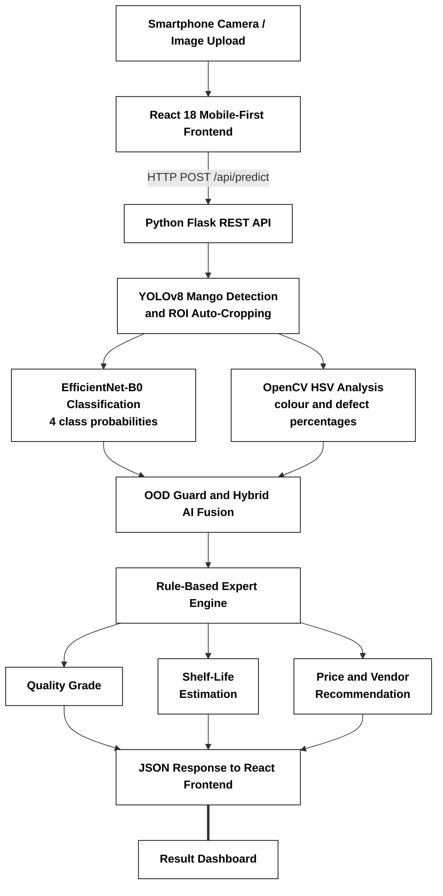

# 🥭 AI-Based Intelligent Mango Quality & Ripeness Assessment System

[](https://pytorch.org/)
[](https://reactjs.org/)
[](https://flask.palletsprojects.com/)
[](https://opencv.org/)

An end-to-end, multi-modal **Artificial Intelligence System** designed for local market vendors and agricultural supply chains to automate mango ripeness classification, surface defect detection, remaining shelf-life estimation, and fair market price valuation.

---

## 🌟 Key Features

* 🧠 **Deep Learning CNN**: EfficientNet-B0 Transfer Learning Architecture (`MangoEfficientNetB0`) trained on custom mobile smartphone photos with Data Augmentation (rotations, flips, color jitter).
* 🏷️ **Directory-Based Supervised Data Labeling**: Custom real-world dataset collection categorized into explicit ground-truth target folders (`Grade_A_Ripe` $\rightarrow$ Class 0, `Grade_B_Unripe` $\rightarrow$ Class 1, `Grade_C_Overripe` $\rightarrow$ Class 2, `Non_Mango` $\rightarrow$ Class 3).
* 🔬 **Computer Vision Feature Extraction**: OpenCV color space transformation (RGB to HSV) calculating real-time ratios for Ripe Yellow %, Unripe Green %, and Dark Decay Spots %.
* 🛡️ **Rule-Based Expert System**: Knowledge-based inference engine processing quality predictions into explainable vendor recommendations, price discounts, and shelf-life predictions.
* 📱 **Mobile-First Responsive React UI**: Sleek glassmorphism single-page app featuring dark/light themes, live camera scanning, and an interactive ripeness spectrum indicator bar.
* 📷 **Native Smartphone Camera Integration**: Web-native camera snap support for mobile smartphones over local Wi-Fi (`capture="environment"`).
* ☁️ **Google Colab Cloud GPU Training**: Pre-configured 1-click cloud notebook (`Mango_Quality_CNN_Training.ipynb`) for training custom datasets on free NVIDIA T4 GPUs.

---

## 🏗️ System Architecture



---

## 📊 Empirical Performance & Evaluation

**Model Architecture**: 
EfficientNet-B0 transfer learning with a 4-class classifier.

**Final Held-Out Test Results**:
- **Test Accuracy**: 91.43%
- **Mango-only Accuracy**: 91.18%
- **Macro F1**: 0.8591
- **Test Set Size**: 70 images

**Classes**:
- Grade A — Ripe
- Grade B — Unripe
- Grade C — Overripe
- Non-Mango

**Hybrid AI Analysis**: 
The hybrid ripeness layer combines CNN predictions with HSV colour and defect evidence. On the untouched test set, it produced the same overall accuracy as the pure CNN model. Therefore, it is used as a supporting interpretability/safety layer rather than being claimed as an accuracy-improvement technique.

**System Limitations**: 
The production pipeline depends on YOLO mango detection/cropping. Difficult images such as extreme angles, blur, or images where the detector cannot confidently locate the mango may result in `Unable_To_Detect`.

---

## 📁 Repository Structure

```
Mango-AI-Quality-System/
├── README.md                           # Project GitHub Documentation
├── server.py                           # Unified Python Flask REST API Server (Port 5000)
├── model.py                            # PyTorch MangoCNN Architecture
├── preprocess.py                       # OpenCV HSV Color Space Feature Extraction
├── hybrid_ripeness.py                  # Hybrid AI fusion layer logic
├── rule_engine.py                      # Rule-Based Expert Pricing Engine
├── train.py                            # PyTorch Model Training & Evaluation Script
├── download_real_mango_dataset.py      # Real Photographic Dataset Downloader
├── Mango_Quality_CNN_Training.ipynb    # Google Colab GPU Training Notebook
├── requirements.txt                    # Python Dependencies
├── testing/                            # Automated Tests & Reports
├── test_images/                        # Sample Demo Test Images
└── frontend/                           # React + Vite Web Application
    ├── src/
    │   ├── App.jsx                     # Main React Component
    │   └── index.css                   # Glassmorphism Design System & Theme Engine
    └── package.json
```

---

> **Note on Model Weights**: Trained binary model weights (`.pth`, `.pt`, `.onnx`) are excluded from this GitHub repository via `.gitignore` due to large file sizes and repository management best practices. They must be downloaded or trained separately before running the system.

## 🚀 Quick Start Guide

### 1. Clone the Repository
```bash
git clone https://github.com/Kavindu379/Mango-AI-Quality-System.git
cd Mango-AI-Quality-System
```

### 2. Install Python Dependencies
```bash
pip install -r requirements.txt
```

### 3. Build the Frontend
```bash
cd frontend
npm install
npm run build
cd ..
```

### 4. Provide Trained Model Weights
Place the trained binary model weights (`mango_model.pth` and `best_seg.pt`) in the root directory before running the system.

### 5. Launch the Unified Web Application
```bash
python server.py
```

Open **`http://localhost:5000`** on your laptop or **`http://<YOUR_LAPTOP_IP>:5000`** on your mobile phone to view your live AI Web Application!

### 6. Running Automated Tests
To run the evaluation tests and update the test reports, run:
```bash
python testing/run_tests.py
```
This script will test API endpoints and generate CSV reports in the `testing/` folder.

---

## 👥 Project Team & Contributors

| Member | Email | Role |
| :--- | :--- | :--- |
| **Kavindu Kavishka** | [rhkkskavishka@gmail.com](mailto:rhkkskavishka@gmail.com) | Lead Developer & Deep Learning Architect |
| **Oneli Fernando** | [onelifernando2918@gmail.com](mailto:onelifernando2918@gmail.com) | Dataset Engineering & Preprocessing |
| **Anjalee Vidurusinghe** | [anjaleevidurusinghe@gmail.com](mailto:anjaleevidurusinghe@gmail.com) | Frontend UI/UX & Mobile Web Application |
| **Umasha Wijewickrama** | [umshsara2019@gmail.com](mailto:umshsara2019@gmail.com) | System Documentation & Quality Assurance |

---


